# TITLE: rn-assignment6-11293368

# Student Info
NAME: MENSAH ERSKINE  
ID: 11293368  
COURSE: DCIT 202  
ASSIGNMENT 7.

# Task Description

The task required adding on to the last assignment design as seen in the UI mockup. 
It also included: 
 
• Adding a product detail component. 

• Make use of local storage to store selected items locally on the device, here I made use of the AsyncStorage. 

• The functionalities should include users being able to:  
-View a list of available products from external API. 
-Add products to their cart. 
-Remove products from their cart. 
-View the items in their cart. 
-Preview detail information about a product.

# Description of How I built my app:

For this particular assignment, I began the process by first setting up all the folders/file structures and installing all the required dependencies and packages. I moved on to make use of components from the previous assignment we are to build upon.
 

## Design choices:
For this particular project,  I didn't really make use of many custom components but rather mainly worked in the same file and also made use of in-line styling. So for the HomeScreen, I did all the creating and styling in the HomePage.js file then rendered it in the App.js file. And for the CartScreen i worked in two files namely the CheckOutPage.js ( for the page's styling and components and also renders the CheckOutComponent.js file ) and CheckOutComponent.js files ( I mainly created the component for the products to be rendered here with their styling ). Lastly for the product details screen, I worked with two files PDcomponent.js(displays the default texts with icon under the selected product.) and ProductDetailScreen.js( renders the PDcomponent and also contains the screen's layout and styling).
 

### HomeScreen:
-  Topmost section: I created a menu icon image, Logo Image, TouchableOpacity components and wrapped it in a view component and applied the required styles to match the UI mockUp.
-  Second section: Made use of the Text component and also the Image and view components.
-  Main section: Firstly, I wrapped the whole section in a scrollview component. Product details from the external API are displayed here, including image, name, description, and price, styled accordingly based on UI. The pairs function found in the file was created to enable rendering product items from its array in consecutive pairs of two. Also the usage of pairs.map enables iterating through each pair of products being displayed. 
- Pressing or touching the plus embedded in circle icon image present for each product adds the specific product to the cart screen.
- And also pressing or touching the texts below the product image directs you to the product details screen to view the product information.
  
### CartScreen:
Here, I also divide the screen into sections but also made us of one custom component 'CheckOutComponent' which contains the data of the selected product on the home Screen to be added to be cart.
-  Topmost section: I created the logo image (redirects user to the home page) and also an image icon placed to it's right.
-  Next is the custom component 'CheckOutComponent' which has the information about the selected product added to the cart.
-  The 'CheckOutComponent' also has a red circle with an embedded 'x' which created fucntionality for removing the particular product from the cart.
-  The bottom section: created a checkout text with an image icon. Also on top of it is some text and the total of all items in the cart computed by a function. 
  
### Product Details Screen:
Here, it has a similar structure to the the homepage screen with reagrds to the topmost part and also for the bottom section similar to that of the chechout page. The only difference here is the PDcomponent which displays the custom texts and required icon images and the focused display of the product details from the home screen.   

## Navigation:
For navigation, I made use of the Drawer Navigator for which I made some adjustment depending on the particular page(It had to do with Custom drawer content and header components). I set the navigation container and drawer navigator up in the App.js file. The main navigation processes involved for each screen includes:

#### HomeScreen:
- The menu icon on the top left corner can be used to have access to all other pages as it opens a drawer menu displaying the available screens.
- To move to the cart screen/page you can touch or press the shopping bag icon on the right top corner and it sends you there.

#### CartScreen:
- The logo on the topmost part of the screen can be used to return back to the home screen.

#### ProductDetailsScreen:
- The menu icon on the top left corner can be used to have access to all other pages as it opens a drawer menu displaying the available screens.
- To move to the cart screen/page you can touch or press the shopping bag icon on the right top corner and it sends to there.
- The logo on the topmost part of the screen can be used to return back to the home screen.

## Implementation of data storage:

### Data Fetching
The HomePage component fetches product data from a remote API (https://fakestoreapi.com/products). This is done using the fetch API within a useEffect hook to ensure the data is fetched when the component mounts.

### Local Storage with AsyncStorage
The app uses AsyncStorage for local storage to persist cart items. AsyncStorage allows the app to store data in a key-value format, which can be retrieved later.

### Adding an Item to Cart:
The addToCheckout function in the HomePage component adds an item to the cart and saves it to AsyncStorage.

### Fetching Items from Cart:
The fetchCheckoutItems function in the CheckOutComponent component retrieves cart items from AsyncStorage.

### Removing an Item from Cart
The removeFromCheckout function removes an item from the cart and updates AsyncStorage.

# Screenshot of app:
 

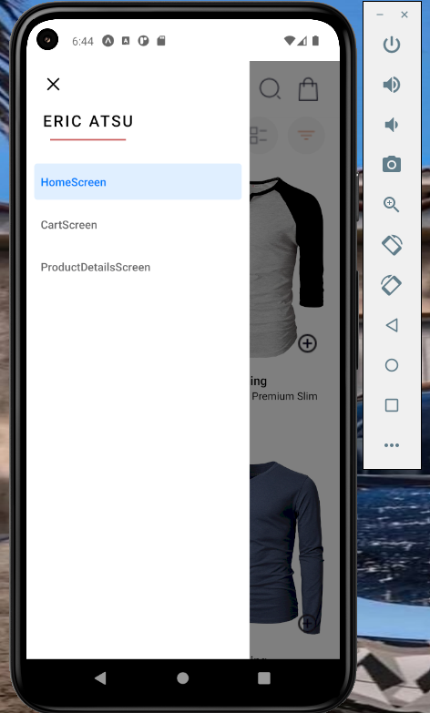   &nbsp;&nbsp;&nbsp;&nbsp;&nbsp;&nbsp;&nbsp;&nbsp;&nbsp;&nbsp;  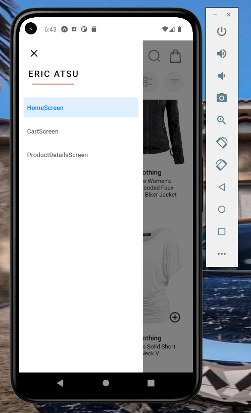 

 

   &nbsp;&nbsp;&nbsp;&nbsp;&nbsp;&nbsp;&nbsp;&nbsp;&nbsp;&nbsp; 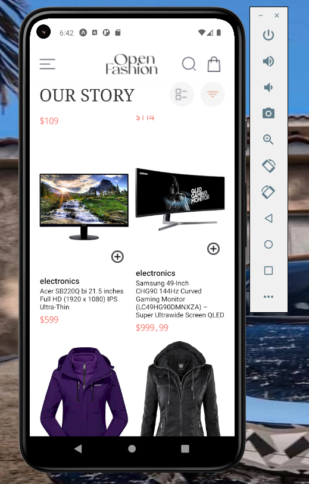 

 

   &nbsp;&nbsp;&nbsp;&nbsp;&nbsp;&nbsp;&nbsp;&nbsp;&nbsp;&nbsp;  

 

   &nbsp;&nbsp;&nbsp;&nbsp;&nbsp;&nbsp;&nbsp;&nbsp;&nbsp;&nbsp;  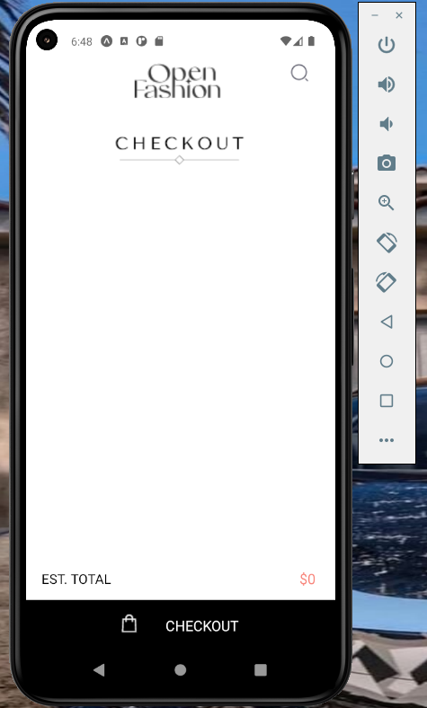

 

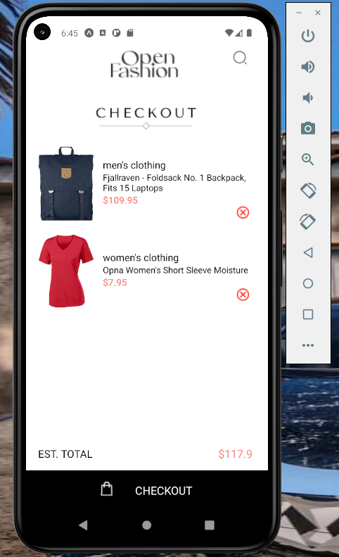   &nbsp;&nbsp;&nbsp;&nbsp;&nbsp;&nbsp;&nbsp;&nbsp;&nbsp;&nbsp;  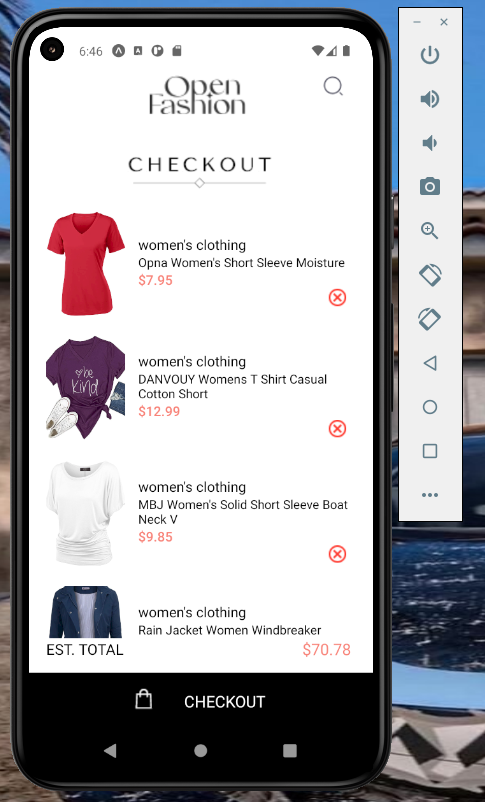

 

   &nbsp;&nbsp;&nbsp;&nbsp;&nbsp;&nbsp;&nbsp;&nbsp;&nbsp;&nbsp;  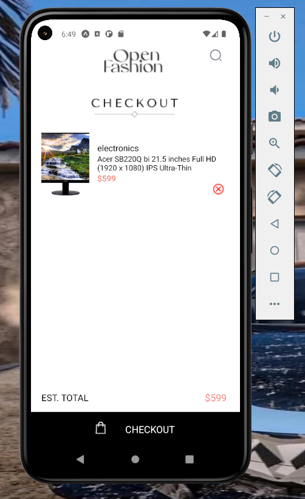

 

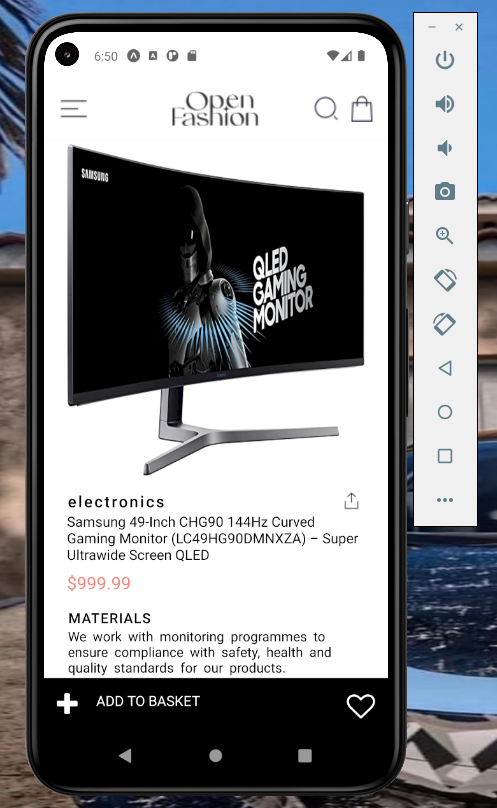   &nbsp;&nbsp;&nbsp;&nbsp;&nbsp;&nbsp;&nbsp;&nbsp;&nbsp;&nbsp;   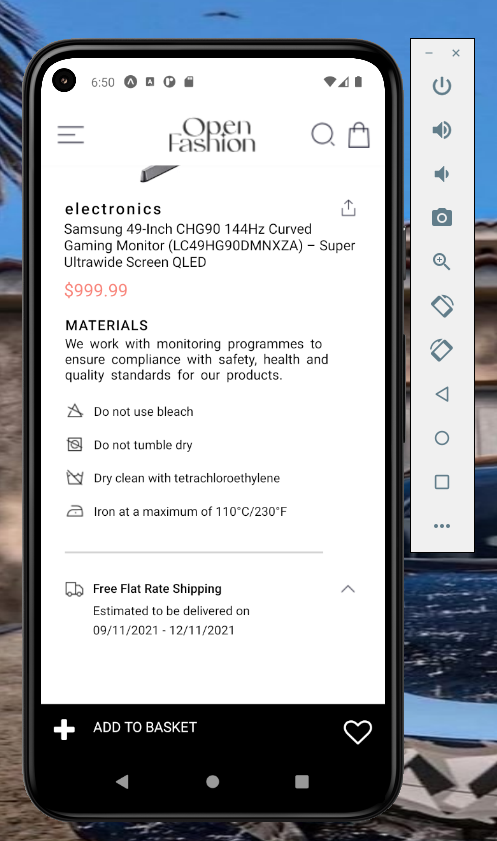

 

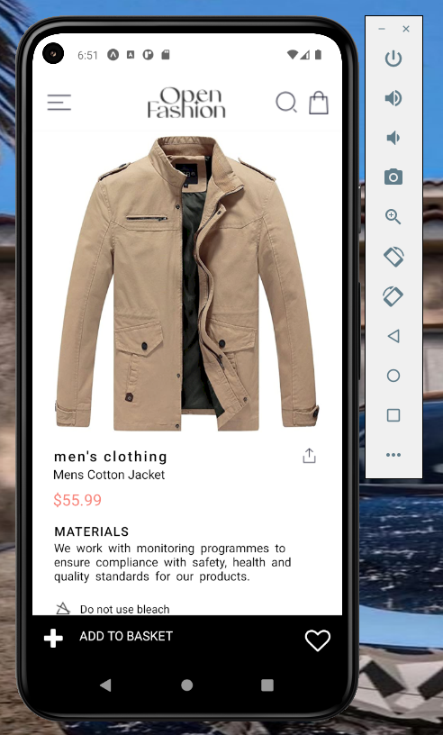   &nbsp;&nbsp;&nbsp;&nbsp;&nbsp;&nbsp;&nbsp;&nbsp;&nbsp;&nbsp;  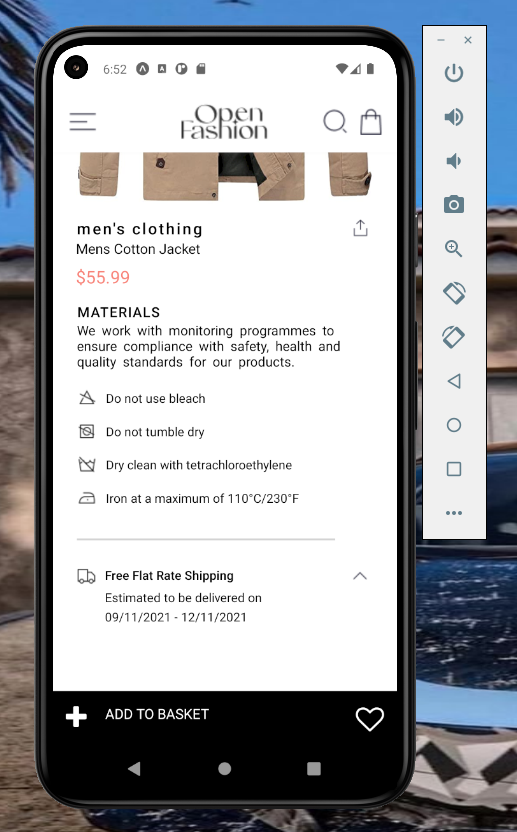

 

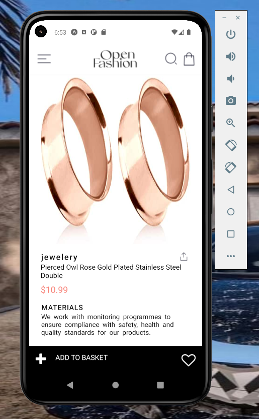   &nbsp;&nbsp;&nbsp;&nbsp;&nbsp;&nbsp;&nbsp;&nbsp;&nbsp;&nbsp;   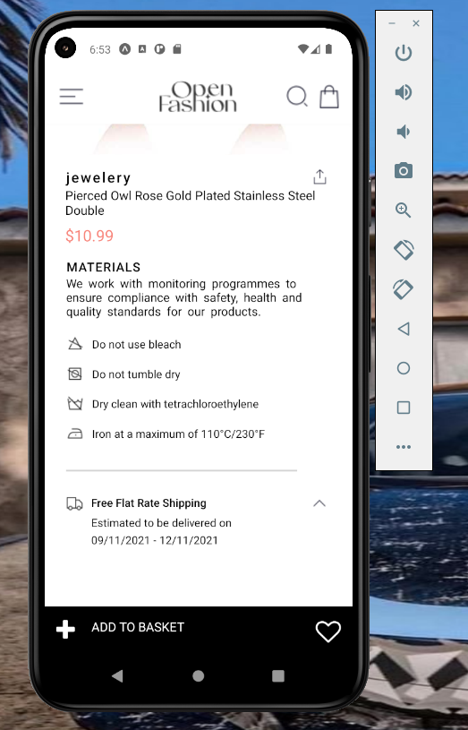